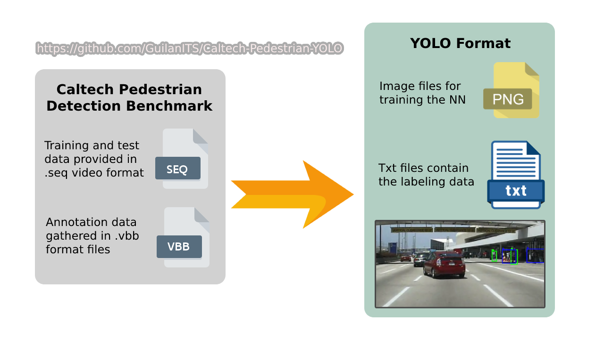

# Caltech Pedestrian to YOLO Converter



This repository provides a set of tools to prepare [Caltech Pedestrian dataset](http://www.vision.caltech.edu/Image_Datasets/CaltechPedestrians/ "Caltech Pedestrian dataset") to the format of YOLO object detector. The toolbox contains three main modules for preparing Caltech Pedestrian data for different versions of YOLO, described as below:

- **Image Generator:** Generates a set of `.png` images from Caltech Pedestrian `.seq` files. By feeding the root directory that contains `set00X` folders in the `config` file, the process of generating images can start.
- **Annotation Generator:** Generates a set of `.txt` annotation (label) files from Caltech Pedestrian `.vbb` files.
- **Plot Annotations:** Draws bounding boxes using annotations on sample generated images. The output will be a video file showing the consequent frames and drawn labels. You need to run this module after the two above.

Please note that set00-set05 are training data and the rest (i.e., set06-set10) are test data ([see link](http://www.vision.caltech.edu/Image_Datasets/CaltechPedestrians/ "see link")).

## ⚙️ Prerequisites

You will need below libraries before running the application.

- Python >= 3.7
- Numpy >= 1.19
- Scipy >= 1.6
- PyInquirer >= 1.0.3
- Opencv-python >= 4.1.1

As an alternative, simply run the below command (root directory):

```python
pip install -r requirements.txt
```

## 🚀 Launch the Application

The first step to run the engine of the application is to provide a proper configuration file. Accordingly, make a copy of the `config.example.py` file in the root directory and rename it to `config.py`. Comments can help you to define proper configurations. Then, you can simply run the program by:

```python
python ./main.py
```

## 💡 Inspiration

- The [framework](https://github.com/mitmul/caltech-pedestrian-dataset-converter "framework") of Shunta Saito
- A [similar work](https://github.com/simonzachau/caltech-pedestrian-dataset-to-yolo-format-converter "similar work") by Simonzachau
